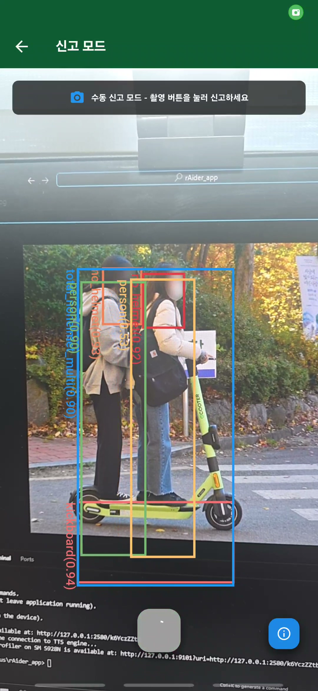
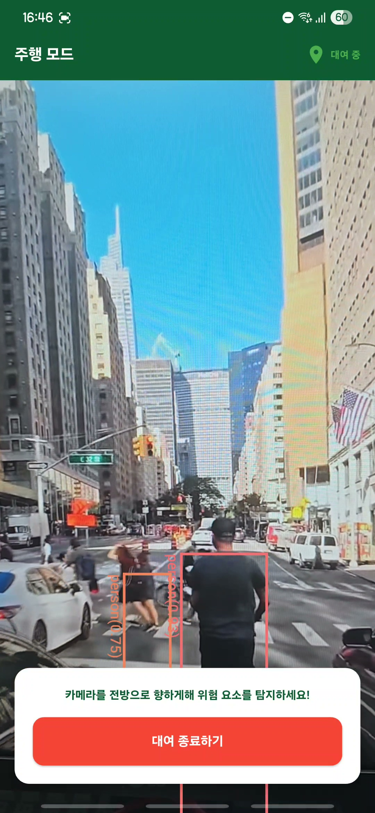
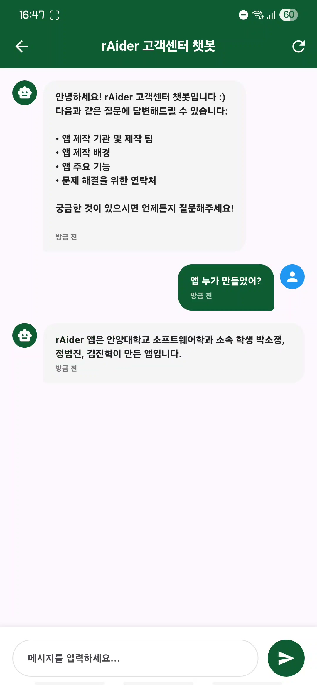

### 공유 전동킥보드를 위한 비전 기반 안전지원서비스
---
**프로젝트 개요**
> 🗓️ : 2025.03 ~ 2025.12  
> Team : 3인  
> Contents : YOLO 모델 기반 전방 장애물 탐지, 헬멧 착용 여부 탐지, 신고 유형 탐지 및 OCR을 활용한 운전면허증 검증 구현 및 MVP 수준의 공유 전동킥보드 대여 APP 및 고객센터 챗봇 개발

---
**프로젝트 기능**
> - 전방 및 노면 장애물 탐지
> - 헬멧 착용 여부 탐지
> - 신고 유형(다인 탑승 및 헬멧 미착용) 탐지
> - OCR 기반 운전면허증 인증
> - RAG 기반 고객센터 챗봇
> - 공유 모빌리티 대여
> - 관리자 웹 페이지

---
**프로젝트 기술&툴**
> 기술 : Python, YOLO, OpenCV, RAG, LangChain, SQL, Flask, Android  
> 툴 : Cursor, MySQL, AWS

---
**프로젝트 데모 화면**   

